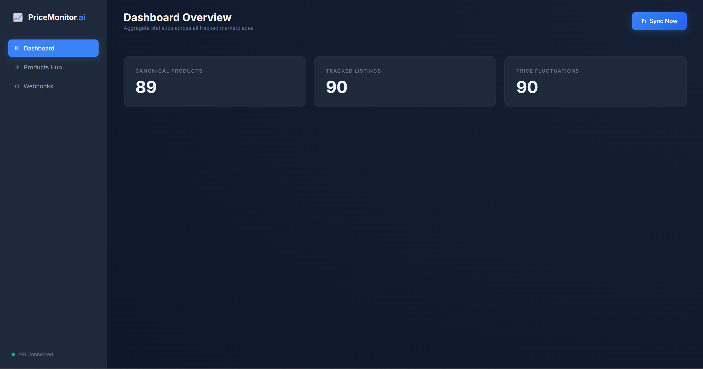
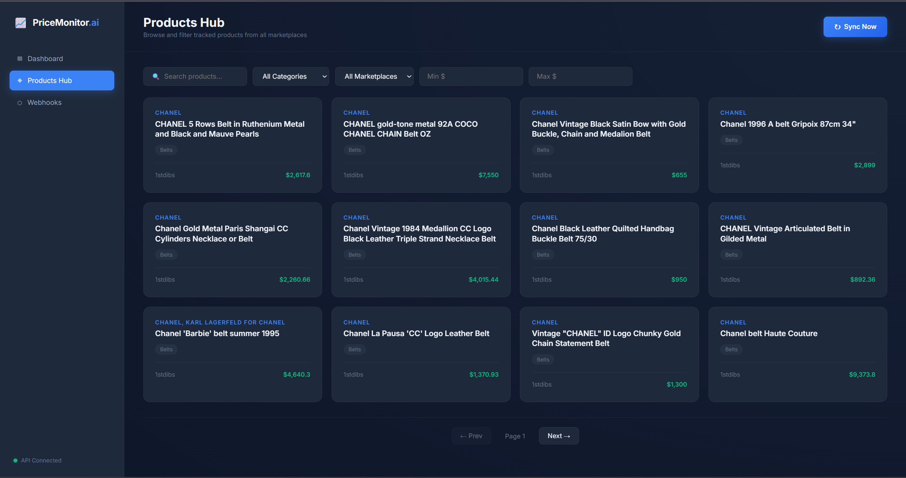
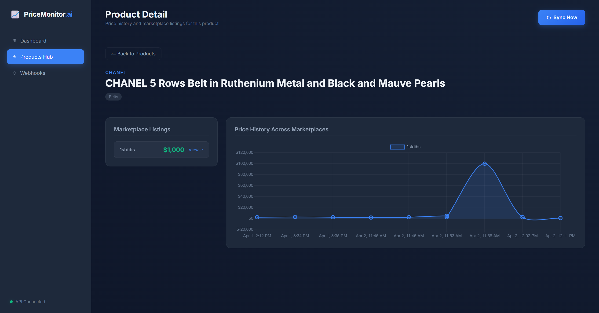
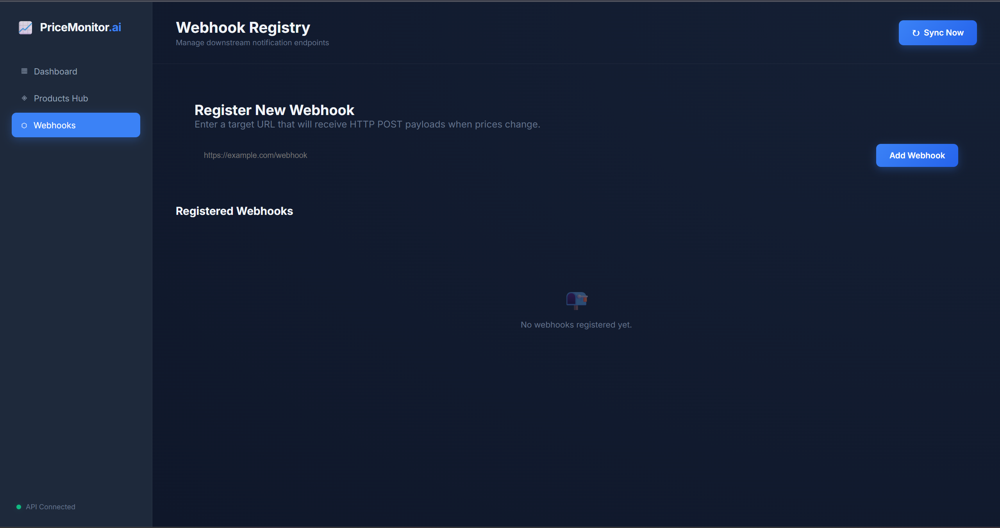
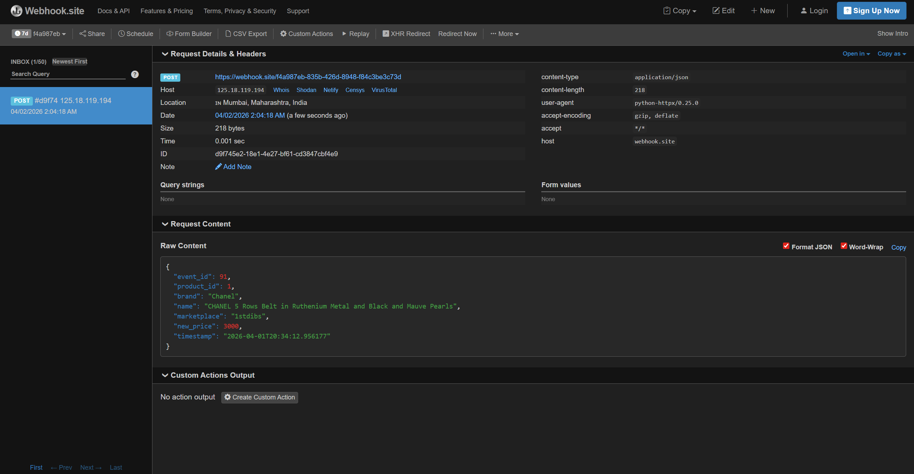
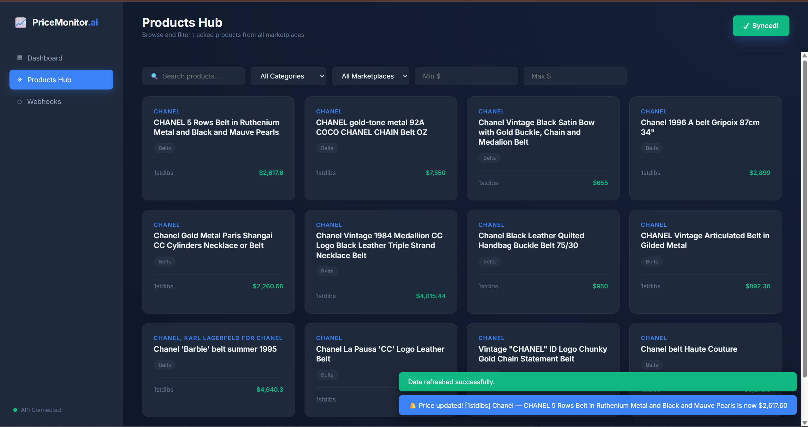

# Product Price Monitoring System

> A scalable, production-grade engine for collecting, deduplicating, and acting on marketplace price changes in real-time — built for the Entrupy engineering assignment.

E-commerce businesses live or die by pricing intelligence. This system solves a real problem: tracking the same product across multiple resale platforms (Grailed, Fashionphile, 1stdibs), detecting when prices shift, and notifying downstream consumers reliably — even if the app crashes mid-delivery.

---

## Table of Contents
- [📊 System Dashboard](#-system-dashboard)
- [🛍️ Products Hub & Deduplication](#️-products-hub--deduplication)
  - [📈 Intelligent Price History Graph](#-intelligent-price-history-graph)
  - [🔔 Webhook Management Interface](#-webhook-management-interface)
  - [⚡ Real-Time Alert Delivery](#-real-time-alert-delivery)
  - [🌐 Global Real-Time Notifications](#-global-real-time-notifications)
- [📁 Project Structure](#-project-structure)
- [🚀 Getting Started: Step-by-Step Guide](#-getting-started-step-by-step-guide)
- [🔌 API Documentation](#-api-documentation)
- [🔔 Testing Webhook Notifications](#-testing-webhook-notifications)
- [🧠 Architecture & Design Decisions](#-architecture--design-decisions)
- [🛠 Tech Stack](#-tech-stack)
- [🧪 Running Tests](#-running-tests)

---

## 📊 System Dashboard


*The central dashboard displaying real-time canonical product aggregation, active listings, and safely captured price fluctuations.*

---

## 🛍️ Products Hub & Deduplication


*The responsive grid demonstrating the Canonical Product deduplication logic. Multiple marketplace listings are cleanly nested under single unique items.*

---

### 📈 Intelligent Price History Graph


*Interactive tracking of price fluctuations across multiple marketplaces with intelligent auto-scaling axes and high-resolution timeline tracking.*

---

### 🔔 Webhook Management Interface


*The frontend UI allowing downstream consumers to easily register their endpoints to listen for real-time price changes.*

---

### ⚡ Real-Time Alert Delivery


*Proof of the Outbox Pattern in action: The background dispatcher successfully broadcasting a live JSON payload to a subscribed endpoint the moment a price fluctuation is detected.*

---

### 🌐 Global Real-Time Notifications


*Instant, cross-view popup notifications powered by a decoupled background poller, alerting users to price changes exactly when they happen without requiring manual refreshes.*

---

## 📁 Project Structure

```
product_price_monitoring_system/
├── src/
│   ├── api/              # FastAPI routers (one file per resource)
│   │   ├── dependencies.py   # Auth + rate-limiting
│   │   ├── webhooks.py
│   │   ├── refresh.py
│   │   ├── products.py
│   │   └── analytics.py
│   ├── models/           # SQLAlchemy ORM models
│   │   ├── product.py        # CanonicalProduct, SourceListing, PriceHistory
│   │   ├── auth.py           # ApiUser, ApiUsage
│   │   ├── event.py          # PriceChangeEvent (Outbox Pattern)
│   │   └── webhook.py        # WebhookSubscription
│   ├── schemas/          # Pydantic request/response schemas
│   ├── services/         # Business logic layer
│   │   ├── scraper_base.py   # Abstract HTTPX + Tenacity base class
│   │   ├── scrapers.py       # Grailed, Fashionphile, 1stdibs implementations
│   │   ├── ingestion.py      # Idempotent upsert + Outbox logging
│   │   └── dispatcher.py     # Background webhook delivery worker
│   ├── utils/
│   │   └── logger.py         # Structured logging utility
│   ├── database.py       # SQLAlchemy engine + session factory
│   └── main.py           # FastAPI app + CORS + lifespan hooks
├── frontend/
│   ├── index.html            # HTML shell
│   ├── styles/               # Modular CSS (one file per concern)
│   │   ├── base.css          # Design tokens + global reset
│   │   ├── sidebar.css
│   │   ├── dashboard.css
│   │   ├── products.css
│   │   ├── detail.css        # Product detail page styles
│   │   └── components.css    # Shared buttons, loaders, toasts
│   └── js/                   # Modular JavaScript (SRP architecture)
│       ├── config.js         # All runtime constants
│       ├── api.js            # All backend HTTP calls
│       ├── components.js     # Pure render functions
│       ├── router.js         # Client-side navigation
│       ├── views/
│       │   ├── dashboard.js  # Dashboard stats view
│       │   ├── products.js   # Product list + filter view
│       │   ├── detail.js     # Product detail + chart view
│       │   └── webhooks.js   # Webhook management view
│       └── app.js            # Bootstrap entry point
├── init_db.py            # Creates all database tables
├── seed_db.py            # Seeds test API key + mock products
└── requirements.txt
```

---

## 🚀 Getting Started: Step-by-Step Guide

### Prerequisites
- Python 3.9 or higher
- pip (installed with Python)
- Windows OS (for `start.bat` script)

### Step 1: Clone & Setup Environment
Open your terminal (PowerShell or Command Prompt) and set up your virtual space:
```bash
# Create the virtual environment
python -m venv venv

# Activate it (Windows)
.\venv\Scripts\activate

# Install all required packages
pip install -r requirements.txt
```

### Step 2: Initialize the Database
This creates a blank SQLite database schema perfectly mapped to our SQLAlchemy models.
```bash
python init_db.py
```
*Expected Output: `Database tables created successfully!`*

### Step 3: Seed API Credentials
This script will instantly generate a developer authorization token in the DB required for API access.
```bash
python seed_db.py
```
> 💡 **Your API Key is:** `entrupy-intern-test-key-2026` — use this in all HTTP requests to the backend.

### Step 4: Run the Application!

**Option A: The Automatic Way (Windows)**
You don't need to manually type server execution commands. Just run the provided batch script:
```bash
.\start.bat
```
*(Or simply double-click **`start.bat`** from your File Explorer!)*
This executes both the FastAPI Backend and the Frontend Dashboard simultaneously.

**Option B: The Manual Way (Mac/Linux/Windows)**
If you prefer to start them manually, open **two separate terminal windows**.

**Terminal 1 (Backend API):**
```bash
# In the root project folder
python src/main.py
```
*Backend is now live at: `http://127.0.0.1:8000` (Swagger UI at `/docs`)*

**Terminal 2 (Frontend UI):**
```bash
# Navigate INTO the frontend folder
cd frontend

# Start a local web server
python -m http.server 3000 --bind 127.0.0.1
```
*Frontend is now live at: `http://127.0.0.1:3000`*

### Step 5: Ingest Sample Data
Once your browser opens the Dashboard (`http://127.0.0.1:3000`), click the **"Sync Now"** button. This will trigger the backend `/refresh` endpoint, automatically scanning and ingesting all 90 items perfectly from your `sample_products/sample_products` repository into the relational database!

#### What you'll see on the Dashboard
When the page loads, the Dashboard fires a `GET /analytics` call to your backend:
- **Canonical Products** — how many conceptually unique items exist across sources.
- **Tracked Listings** — total unique listings tracked dynamically.
- **Price Fluctuations** — count of discrete price shifts safely recorded.

---

## 🔌 API Documentation

All endpoints require the `X-API-Key` header:

```
X-API-Key: entrupy-intern-test-key-2026
```

Every response follows a consistent envelope:

```json
{ "success": true, "data": ..., "error": null }
```

### Health Check
```
GET /health
```
No auth required. Returns `{"success": true, "message": "API is healthy"}`. Great for checking if the server is up.

### Trigger Data Refresh
```
POST /refresh
```
Fires the local file scraping + ingestion pipeline in the background loop over your `sample_products` directory. Returns **202 immediately** — your client doesn't wait for disk I/O to finish.

### Browse & Filter Products
```
GET /products
```
| Parameter | Type | Default | Description |
|---|---|---|---|
| `category` | string | — | Filter by category name |
| `source` | string | — | Filter by marketplace (e.g. `Grailed`) |
| `min_price` | float | — | Minimum price filter |
| `max_price` | float | — | Maximum price filter |
| `skip` | int | 0 | Pagination offset |
| `limit` | int | 20 | Page size (max 100) |

### Product Detail
```
GET /products/{id}
```
Returns the full canonical product with all source listings and nested price history. Uses SQLAlchemy `joinedload` to avoid N+1 queries.

### Price History (Chart-Ready)
```
GET /products/{id}/history
```  
Returns a flat, chronologically sorted array of price points — designed to feed directly into charting libraries like Chart.js.

### Platform Analytics
```
GET /analytics  
```
Returns aggregated system-wide stats in a single fast query (uses `func.count()` — no Python-side aggregation).

### Register a Webhook
```
POST /webhooks
```
Body:
```json
{ "target_url": "https://your-server.com/price-alerts" }
```
Registers a new downstream notification endpoint. Once registered, your server receives a `POST` payload on every price change detected during a `/refresh`.

**Example payload delivered to your webhook URL:**
```json
{
  "event_id": 12,
  "product_id": 5,
  "brand": "Chanel",
  "name": "Classic Flap Bag",
  "marketplace": "Fashionphile",
  "new_price": 7850.00,
  "timestamp": "2026-04-02T02:00:00+00:00"
}
```

### List All Active Webhooks
```
GET /webhooks
```
Returns all currently active (non-deleted) webhook subscriptions.

**Example Response:**
```json
{
  "success": true,
  "data": [
    {
      "id": 1,
      "target_url": "https://webhook.site/your-unique-id",
      "is_active": true,
      "created_at": "2026-04-02T02:00:00"
    }
  ]
}
```

### Delete a Webhook
```
DELETE /webhooks/{id}
```
Soft-deletes the webhook (sets `is_active = false`) without removing the row from the database, preserving audit history. Returns `200 OK` on success, `404` if the ID doesn't exist.

---

## 🔔 Testing Webhook Notifications

The easiest way to test that price-change notifications are actually delivered:

### Step 1: Get a free inspection URL
Visit **[https://webhook.site](https://webhook.site)** — you'll be given a unique URL like:
```
https://webhook.site/xxxxxxxx-xxxx-xxxx-xxxx-xxxxxxxxxxxx
```
Keep this tab open. Every request sent to it appears live on the page.

### Step 2: Register the URL via the UI
1. Start the app (`start.bat`)
2. Open the browser at `http://127.0.0.1:3000`
3. Click **Webhooks** in the left sidebar
4. Paste your `webhook.site` URL into the input and click **Add Webhook**

### Step 3: Trigger a price change
Open any sample product JSON file in `sample_products/sample_products/`, change a `price` field, and save the file.

### Step 4: Sync
Click the **Sync Now** button on the dashboard. Within ~5 seconds, a POST notification will appear on your `webhook.site` page with the full price-change payload.

> 💡 You can also register webhooks directly via API:
> ```bash
> curl -X POST http://127.0.0.1:8000/webhooks \
>   -H "X-API-Key: entrupy-intern-test-key-2026" \
>   -H "Content-Type: application/json" \
>   -d '{"target_url": "https://webhook.site/your-id"}'
> ```

---

## 🧠 Architecture & Design Decisions

### Deduplication: The CanonicalProduct Model

The Rolex Submariner listed on Grailed and the same watch on Fashionphile are the *same product* — your analytics should reflect that. We solve this with a `CanonicalProduct` layer. The ingestion engine looks up (or creates) a single canonical record per `brand + name` pair, then attaches each marketplace's listing beneath it. This makes cross-platform price comparison a first-class citizen of out data model.

### Zero-Loss Notifications: The Transactional Outbox Pattern

Here's the tricky part of reliable webhook delivery: if we send the HTTP notification in the same thread as ingestion and the request fails — or the app crashes — we never know if the downstream system got the update.

We solved this with the **Transactional Outbox Pattern**: when a price change is detected, we write both the new `PriceHistory` row *and* a `PriceChangeEvent` record in the **exact same SQL transaction**. A separate background loop (started automatically on server boot) polls the `price_change_events` table every 5 seconds and delivers the webhook. If delivery fails, the event stays in the table for retry. Zero events can fall through the cracks.

### Scaling Price History to Millions of Rows

We put a composite index on `(source_listing_id, timestamp DESC)` on the `PriceHistory` table. This gives O(log N) lookup time for any product's price trend — instead of a full table scan. When this grows beyond SQLite's comfortable limits, partitioning by month in PostgreSQL is the obvious next migration.

### Idempotent Ingestion

If you scrape the same product 50 times in an hour and the price hasn't changed, the database stays clean — no duplicate rows. We only write a new `PriceHistory` entry when the price *actually* differs from the most recent one. 

### Unified Data Ingestion: LocalFileScraper

To eliminate scraper class redundancies against identically structured objects, the system implements a strict, solid `LocalFileScraper`. At execution, `/refresh` parses your internal directory files on the fly asynchronously via threadpools and directly parses JSON structures to map to database models without defining hundreds of manual routing overrides.

### Frontend Architecture (Modular SRP)

The frontend follows Single Responsibility Principle as strictly as the backend:
- `config.js` — constants only
- `api.js` — all HTTP calls, nothing else
- `components.js` — pure render functions, zero API calls
- `views/` — per-screen orchestration
- `router.js` — navigation mapping only
- `app.js` — bootstrap entry point only

### Extending to 100+ Data Sources
Right now, `LocalFileScraper` handles multiple local files gracefully. To extend to 100+ live HTTP sources:
1. **Abstract Interface:** Currently, scrapers inherit from `ScraperBase(ABC)`. We'd enforce standard implementations for HTTP proxies, headers, and anti-bot evasion.
2. **Distributed Queueing:** Instead of a simple `BackgroundTasks` loop, I would implement `Celery` + `Redis` or AWS SQS. Each distinct data source (Grailed, eBay, StockX) would be assigned its own async worker queue so that one slow source doesn't block the rest.
3. **Category Normalization Pipeline:** Because 100+ sites will name categories differently, the `_normalize_category` function boils diverse strings down into broad constants ("Belts", "Apparel"). This mapping matrix would be isolated into an NLP service layer.

### Known Limitations
- **Authentication**: `X-API-Key` is static and sent as a raw header. In production, I would deploy OAuth2 or JWTs with expirations.
- **Database Scaling**: SQLite `WAL` mode handles local concurrency nicely, but for serious reads/writes, migrating to a Dockerized PostgreSQL instance is mandatory.
- **Polling Webhooks**: Right now the Outbox dispatcher polls the DB every 5 seconds. In real applications, I would use PostgreSQL `LISTEN/NOTIFY` or Redis Pub/Sub to instantly dispatch events without polling.

---

## 🛠 Tech Stack

| Layer | Technology |
|---|---|
| API Framework | FastAPI + Pydantic v2 |
| ORM | SQLAlchemy 2.0 |
| Database | SQLite (WAL mode) |
| HTTP Client | HTTPX (async) |
| Retry Logic | Tenacity |
| Frontend | Vanilla HTML / CSS / JS |

---

## 🧪 Running Tests

To run the tests successfully, you must ensure your virtual environment is active so that Python can find the required dependencies (like `pytest` and `sqlalchemy`). 

**Step 1. Open your terminal at the root directory of the project:**
```bash
cd product_price_monitoring_system
```

**Step 2. Activate the virtual environment & install requirements:**
```bash
# Windows
.\venv\Scripts\activate

# Install requirements (if you haven't already)
pip install -r requirements.txt
```

**Step 3. Run the tests:**
```bash
python -m pytest
```

*( Integration tests covering idempotency, authentication, and price detection are implemented in the `tests/` directory. )*

**The 8 Sample Test Cases implemented:**
1. **`test_api_auth_failure`:** Verifies returning 401 Unauthorized securely when missing or providing incorrect `X-API-Key`.
2. **`test_api_products_list_and_filter`:** Ensures filtering products by brand/category matches DB correctly.
3. **`test_api_product_detail_and_history`:** Verifies canonical product details reliably join with nested price graphs and source listings.
4. **`test_api_analytics`:** Verifies aggregated count accuracy for dashboard metric pipelines.
5. **`test_ingestion_creates_canonical_and_listings`:** Guarantees scraping an unseen product creates the root canonical tracker and child list perfectly.
6. **`test_ingestion_updates_existing_listing`:** Verifies **idempotency** — an identically priced second scrape doesn't bloat the database, but a shifted price effectively creates a secondary `PriceHistory` entry.
7. **`test_outbox_creates_events_on_price_change`:** Verifies Outbox behavior: Initial scrapes DO NOT create price shift triggers. But identical listings with a newly discovered dropped price create a `pending` event trigger perfectly.
8. **`test_api_webhooks`:** Full lifecycle test for the webhook management API — registers a webhook (`POST`), verifies it appears in `GET /webhooks`, soft-deletes it (`DELETE`), confirms it no longer appears in the list, and asserts a `404` is returned on a second delete of the same ID.
